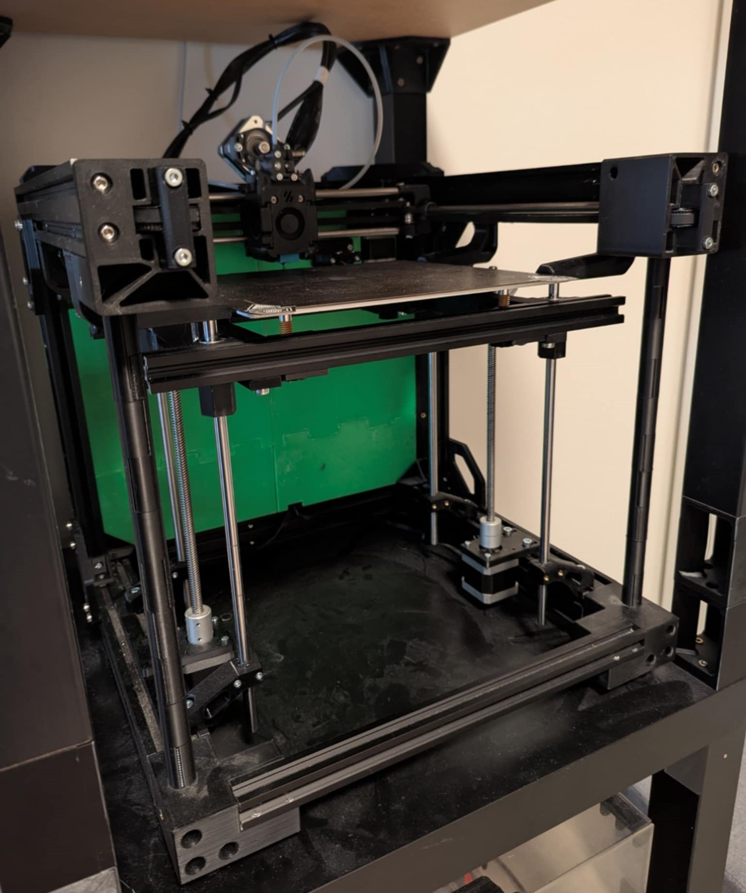

# Klipper Configuration backup

This repository contains the Klipper (Mainsail) firmware configuration files for custom moded  Ender 3 NG. 

Ender 3 Pro conversion to coreXY with moded dual Z axis (insdesad of triple Z axis from original project).

## Hardware Specs
SKR Pico, original creality steppers, E3D V6 hotend with Dragonburner toolhead, klicky, Sherpa extruder using nema 17 stepper and BMG kit.

---

## Preview

---

## 🔗 Important Links

- [Original project E3NG BETA](https://www.printables.com/model/469280-ender-3-ng-corexy-beta)
- [Original project E3NG v1.2](https://www.printables.com/model/922401-ender-3-ng-v12-corexy-conversion)
- [Sherpa nema 17 extruder](https://www.printables.com/model/549890-sherpa-extra-heavy-with-nema17-update-2)
- [Dragonburner toolhead](https://github.com/chirpy2605/voron/tree/main/V0/Dragon_Burner)
- [Dragonburner carriage mod](https://www.printables.com/model/813622-db4eng-dragon-burner-mount-ender3-ng/files)

